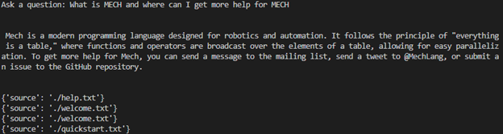

# Mech-Assistant

Allows [Mech (programming language)](https://mech-lang.org/) users to ask questions about the language and even generate some Mech code based on conversation-level descriptions. Built using Python's LangChain library and publically available Mech documentation and code samples.

# Some Examples

## 1. Simple Questions




## 2. Code Generation


## 3. Code Explanations

``` python
# code snippet from n-body simulation program in Mech

jupiter = [4.84143144246472090, -1.16032004402742839, -0.103622044471123109, 0.00166007664274403694 * days-per-year, 0.00769901118419740425 * days-per-year, -0.0000690460016972063023 * days-per-year, 0.000954791938424326609 * solar-mass]

b = [|x y z vx vy vz mass| sun; jupiter; saturn; uranus; neptune]
```


